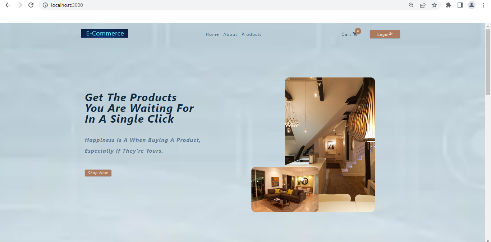
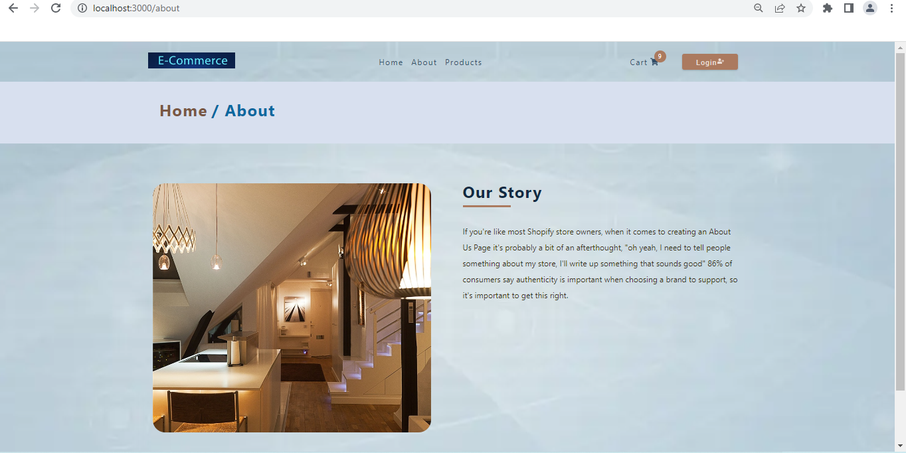
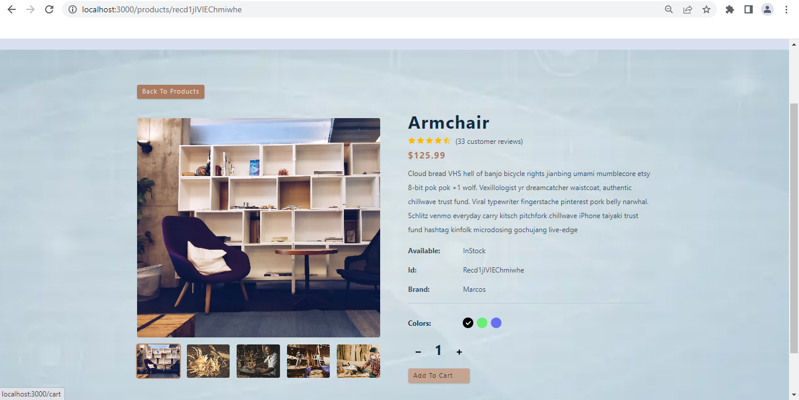
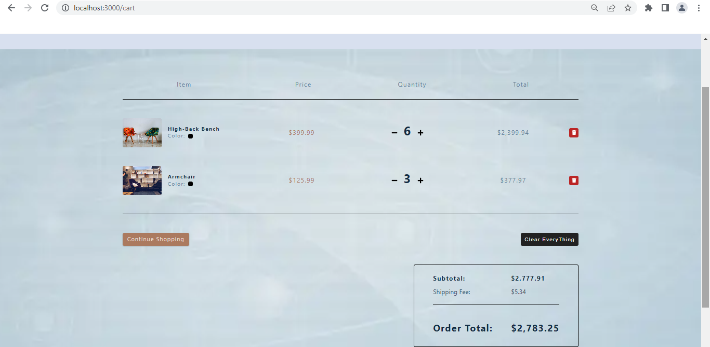

 let's build a E-commerce Project by applying the concepts like **useContext,useReducer, Routes,**
and also user can **Filter** the products as per his Requirement

  ## ScreenShots of Final Output
 
  **HomePage**

  
   
  **AboutPage**

   

  **ProductsPage** 

  

  **Single Product**

  

  **CartPage**

  


### Note

## Styled Components

[Styled-Components - Main Docs](https://styled-components.com/)

```jsx
import styled from "styled-components";

const ReactComponent = () => {
 // logic here
 return <Wrapper>
 {some content}
 </Wrapper>
}


const Wrapper = styled.htmlElement`
write your styles here
`
export default ReactComponent
```


## Auth0

- [Auth0 - Main Docs](https://auth0.com/)

- Create Application
- Choose : Single Page Web Applications
- Choose : React
- Go to Settings Tab
- Copy/Paste Domain, ClientID in index.js - can be public (or use .env)

```index.js
const root = ReactDOM.createRoot(document.getElementById('root'));
root.render(
<Auth0Provider
    domain= 'Your Domain Name'
    clientId=  'Your ClientId'
    redirectUri={window.location.origin} >
    <!-- Imports If you have any -->
            <App />
    <!-- Imports if you have any  -->
  </Auth0Provider>,
  )
```
- Add Domain -
  for now http://localhost:3000 (DON'T COPY PASTE FROM URL BAR)

  - Allowed Callback URLs
  - Allowed Logout URLs
  - Allowed Web Origins
  - SAVE CHANGES

- Connections
  email,social


